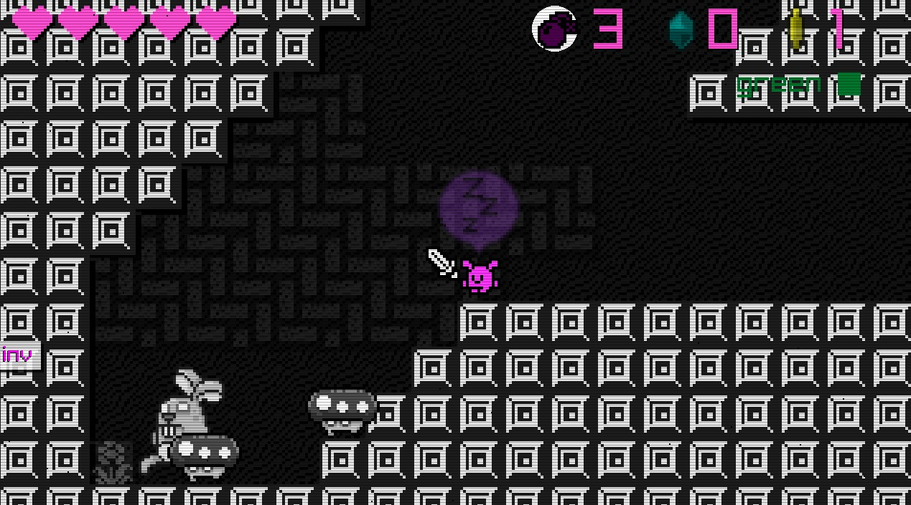
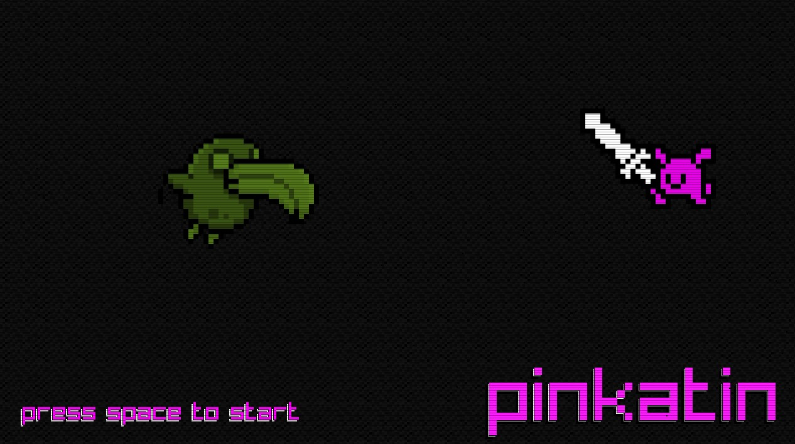
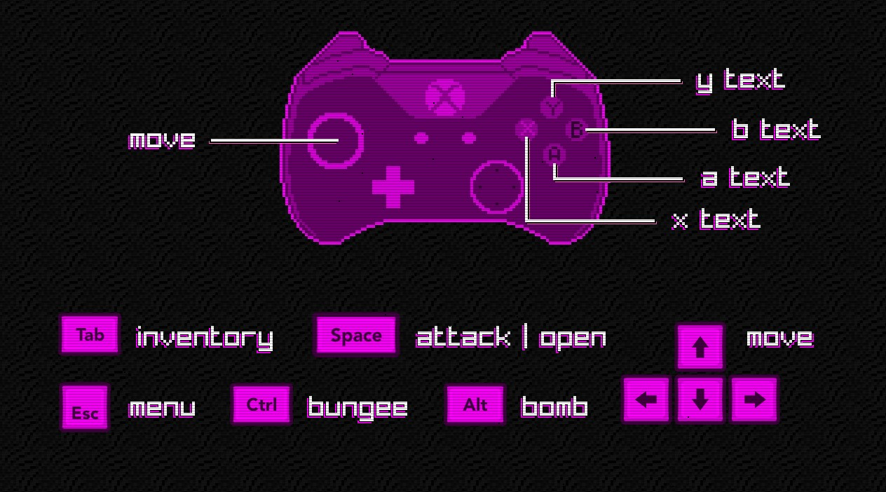
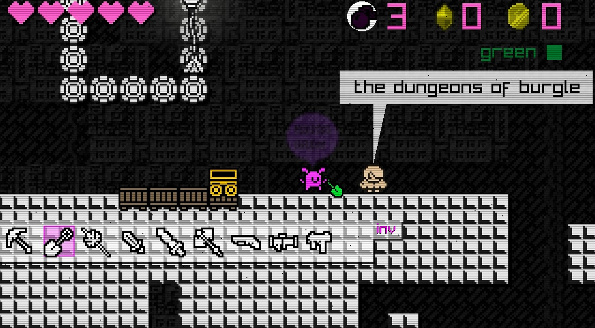

An attempt to make a 1-bit metroidvania style platform exploration game. The basic underlying elements are complete, inventory/weapon selection, enemies, powerups, quests just need to actually finish the game. 

Anyway if you do want to try it here are the keys:
Arrow keys -  movement
Left Control - Bungee jump/Interact 1
Left Alt - Bomb
Space - Attack/Interact 2
Escape - Options Menu
Keypad 1 - Start Screen
Keypad 3 - Intro Screen 
Keypad Delete - Debug 
Keypad * - Center Lines
Keypad +/- - Zoom Controls
F1 -Draw Grid

Unfortunately gave up before I added controller support or sound however the screen resolution can be changed.
  

  

  

  

  
